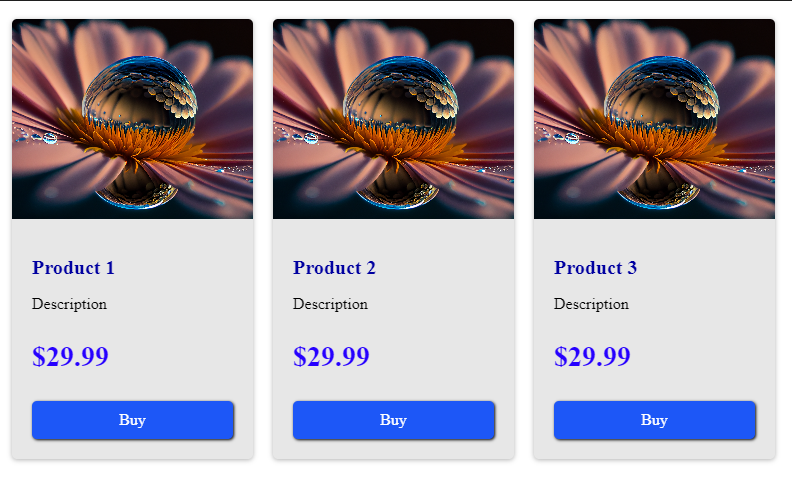

# WEB-LAB-4

<p align = "center">МИНИСТЕРСТВО НАУКИ И ВЫСШЕГО ОБРАЗОВАНИЯ<br>
РОССИЙСКОЙ ФЕДЕРАЦИИ<br>
ФЕДЕРАЛЬНОЕ ГОСУДАРСТВЕННОЕ БЮДЖЕТНОЕ<br>
ОБРАЗОВАТЕЛЬНОЕ УЧРЕЖДЕНИЕ ВЫСШЕГО ОБРАЗОВАНИЯ<br>
«САХАЛИНСКИЙ ГОСУДАРСТВЕННЫЙ УНИВЕРСИТЕТ»</p>
<br><br><br><br><br><br>
<p align = "center">Институт естественных наук и техносферной безопасности<br>Кафедра информатики<br>Шинкаренко Кирилл Константинович</p>
<br><br><br>
<p align = "center"><br><strong>Лабораторная работа №4.«CSS»</strong><br>01.03.02 Прикладная математика и информатика</p>
<br><br><br><br><br><br><br><br><br><br><br><br>
<p align = "right">Научный руководитель<br>
Соболев Евгений Игоревич</p>
<br><br><br>
<p align = "center">г. Южно-Сахалинск<br>2024 г.</p>
<br><br><br><br><br><br><br><br><br><br><br><br>

<h1 align = "center">Введение</h1>

<p><b>HTML</b> —  стандартизированный язык гипертекстовой разметки документов для просмотра веб-страниц в браузере. Веб-браузеры получают HTML документ от сервера по протоколам HTTP/HTTPS или открывают с локального диска, далее интерпретируют код в интерфейс, который будет отображаться на экране монитора.</p>
<p><b>CSS</b> — формальный язык описания внешнего вида документа, написанного с использованием языка разметки. Также может применяться к любым XML-документам, например, к SVG или XUL.</p>


<h1 style="text-align: center">Задачи HTML</h1>
<ol>
    <li>Используйте 3 способа подключения CSS.</li>
    <li>Сделайте все абзацы &lt;p&gt; красного цвета.</li>
    <li>Сделайте все &lt;h1&gt; зеленого цвета.</li>
    <li>Сделайте все &lt;h2&gt; голубого цвета.</li>
    <li>Сделайте все &lt;h3&gt; оранжевого цвета.</li>
    <li>Сделайте первый на странице абзац &lt;p&gt; зеленого цвета.</li>
    <li>Сделайте второй на странице абзац &lt;p&gt; красного цвета.</li>
    <li>Сделайте все абзацы &lt;h2&gt; шириной 300px.</li>
    <li>Сделайте все таблицы &lt;table&gt; шириной 400px, высотой 200px.</li>
    <li>Поставьте все &lt;h1&gt; по центру.</li>
    <li>Поставьте все &lt;h2&gt; по правому краю.</li>
    <li>Сделайте так, чтобы текст в абзацах &lt;p&gt; был выровнен одновременно и по правому и по левому краю.</li>
    <li>Сделайте так, чтобы во втором абзаце &lt;p&gt; текст был выровнен по центру.</li>
    <li>Поставьте все &lt;th&gt; по левому краю.</li>
    <li>Поставьте все &lt;td&gt; по центру.</li>
    <li>Сделайте все &lt;td&gt; жирным.</li>
    <li>Сделайте &lt;h1&gt; нежирным.</li>
    <li>Сделайте одновременно &lt;th&gt;, &lt;h1&gt; и &lt;h2&gt; нежирным.</li>
    <li>Сделайте все &lt;h2&gt; курсивом.</li>
    <li>Сделайте все абзацы &lt;p&gt; курсивом, а первый абзац - нет.</li>
    <li>Сделайте все &lt;h2&gt; 20px.</li>
    <li>Сделайте все абзацы &lt;p&gt; 15px.</li>
    <li>Сделайте для абзацев &lt;p&gt; шрифт Arial.</li>
    <li>Сделайте для &lt;h2&gt; шрифт Times New Roman.</li>
    <li>Сделайте для &lt;h3&gt; любой шрифт без засечек.</li>
    <li>Сделайте межстрочный интервал для абзацев &lt;p&gt; в 30px.</li>
    <li>Закомментируйте некоторые стили для абзацев.</li>
    <li>Для &lt;p&gt; сделайте шрифт Arial, 16 пикселей, курсив, жирный, межстрочный интервал в 30px.</li>
    <li>Для &lt;h1&gt; сделайте следующий шрифт: нежирный, 20 пикселей, Verdana.</li>
    <li>Сделайте красную строку в абзацах 30px.</li>
    <li>Для второго абзаца &lt;p&gt; уберите красную строку.</li>
    <li>Поставьте текст в таблице &lt;table&gt; по верхнему краю по вертикали.</li>
    <li>Поставьте текст в &lt;th&gt; по центру по вертикали.</li>
    <li>Повторите страницу по данному по образцу.</li>
    <li>Повторите страницу по данному по образцу.</li>
</ol>

<h1 style="text-align: center">Задачи CSS</h1>
<ol>
    <li>Создать анимированный кнопку с использованием CSS</li>
    <li>Создать адаптивный макет страницы с помощью CSS Grid</li>
    <li>Стилизовать форму ввода данных с использованием CSS</li>
    <li>Создать анимированное меню навигации с использованием CSS</li>
    <li>Изучить и применить различные типы селекторов в CSS</li>
    <li>Создать градиентный фон с использованием CSS</li>
    <li>Изучить и применить различные свойства шрифтов в CSS</li>
    <li>Создать анимированный слайдер изображений с использованием CSS</li>
    <li>Изучить и применить различные методы позиционирования элементов в CSS</li>
    <li>Создать адаптивный макет с использованием медиа-запросов в CSS</li>
    <li>Изучить и применить различные техники создания анимаций с помощью CSS</li>
    <li>Создать стилизованные карточки товаров с использованием CSS</li>
    <li>Изучить и применить различные единицы измерения в CSS (px, em, rem, %)</li>
    <li>Создать анимированную загрузку страницы с использованием CSS</li>
    <li>Изучить и применить различные способы создания теней и эффектов в CSS</li>
</ol>


<h1 style="text-align: center">Решения HTML</h1>

<h2 style="text-align: center">Файлы 1.html - 35.html</h2>

1
```html
<!DOCTYPE html>
<html lang="en">
<head>
    <meta charset="UTF-8">
    <meta name="viewport" content="width=device-width, initial-scale=1.0">
    <!-- ПЕРВЫЙ СПОСОБ -->
    <link rel="stylesheet" href="/1.css">
    <style>
        /* ВТОРОЙ СПОСОБ */
        * {
            padding: 0;
            margin: 0;
            box-sizing: border-box;
        }
    </style>
    <title>Document</title>
</head>
<body>
    <div>
        <!-- ТРЕТИЙ СПОСОБ -->
        <p style="text-align: center;">Lorem ipsum dolor sit amet consectetur adipisicing elit. Odit, esse!</p>
    </div>
</body>
</html>
```
2
```html
<!DOCTYPE html>
<html lang="en">
<head>
    <meta charset="UTF-8">
    <meta name="viewport" content="width=device-width, initial-scale=1.0">
    <title>Document</title>
    <style>
        p {
            color: red;
        }
    </style>
</head>
<body>
    <p>Lorem, ipsum dolor sit amet consectetur adipisicing elit. Aspernatur, repellendus.</p>
    <p>Lorem, ipsum dolor sit amet consectetur adipisicing elit. Aspernatur, repellendus.</p>
    <p>Lorem, ipsum dolor sit amet consectetur adipisicing elit. Aspernatur, repellendus.</p>
    <p>Lorem, ipsum dolor sit amet consectetur adipisicing elit. Aspernatur, repellendus.</p>
    <p>Lorem, ipsum dolor sit amet consectetur adipisicing elit. Aspernatur, repellendus.</p>
    <p>Lorem, ipsum dolor sit amet consectetur adipisicing elit. Aspernatur, repellendus.</p>
    <p>Lorem, ipsum dolor sit amet consectetur adipisicing elit. Aspernatur, repellendus.</p>
    <p>Lorem, ipsum dolor sit amet consectetur adipisicing elit. Aspernatur, repellendus.</p>
</body>
</html>
```
3
```html
<!DOCTYPE html>
<html lang="en">
<head>
    <meta charset="UTF-8">
    <meta name="viewport" content="width=device-width, initial-scale=1.0">
    <title>Document</title>
    <style>
        h1 {
            color: green;
        }
    </style>
</head>
<body>
    <h1>Lorem ipsum dolor sit amet consectetur, adipisicing elit. Dolor, explicabo.</h1>
    <h1>Lorem ipsum dolor sit amet consectetur, adipisicing elit. Dolor, explicabo.</h1>
    <h1>Lorem ipsum dolor sit amet consectetur, adipisicing elit. Dolor, explicabo.</h1>
</body>
</html>
```
4
```html
<!DOCTYPE html>
<html lang="en">
<head>
    <meta charset="UTF-8">
    <meta name="viewport" content="width=device-width, initial-scale=1.0">
    <title>Document</title>
    <style>
        h2 {
            color: rgb(62, 62, 167);
        }
    </style>
</head>
<body>
    <h2>Lorem ipsum dolor sit amet consectetur, adipisicing elit. Dolor, explicabo.</h1>
    <h2>Lorem ipsum dolor sit amet consectetur, adipisicing elit. Dolor, explicabo.</h1>
    <h2>Lorem ipsum dolor sit amet consectetur, adipisicing elit. Dolor, explicabo.</h1>
</body>
</html>
```
5
```html
<!DOCTYPE html>
<html lang="en">
<head>
    <meta charset="UTF-8">
    <meta name="viewport" content="width=device-width, initial-scale=1.0">
    <title>Document</title>
    <style>
        h3 {
            color: orange;
        }
    </style>
</head>
<body>
    <h3>Lorem ipsum dolor sit amet consectetur, adipisicing elit. Dolor, explicabo.</h1>
    <h3>Lorem ipsum dolor sit amet consectetur, adipisicing elit. Dolor, explicabo.</h1>
    <h3>Lorem ipsum dolor sit amet consectetur, adipisicing elit. Dolor, explicabo.</h1>
</body>
</html>
```
6
```html
<!DOCTYPE html>
<html lang="en">
<head>
    <meta charset="UTF-8">
    <meta name="viewport" content="width=device-width, initial-scale=1.0">
    <title>Document</title>
    <style>
        p:first-child {
            color: green;
        }

    </style>
</head>
<body>
    <p>Lorem ipsum dolor sit amet consectetur, adipisicing elit. Repellat, tenetur.</p>
    <p>Lorem ipsum dolor sit amet consectetur, adipisicing elit. Repellat, tenetur.</p>
    <p>Lorem ipsum dolor sit amet consectetur, adipisicing elit. Repellat, tenetur.</p>
    <p>Lorem ipsum dolor sit amet consectetur, adipisicing elit. Repellat, tenetur.</p>
</body>
</html>
```
7
```html
<!DOCTYPE html>
<html lang="en">
<head>
    <meta charset="UTF-8">
    <meta name="viewport" content="width=device-width, initial-scale=1.0">
    <title>Document</title>
    <style>
        p:nth-child(2) {
            color: red;
        }
    </style>
</head>
<body>
    <p>Lorem ipsum dolor sit amet, consectetur adipisicing elit. Corrupti, aut.</p>
    <p>Lorem ipsum dolor sit amet, consectetur adipisicing elit. Corrupti, aut.</p>
    <p>Lorem ipsum dolor sit amet, consectetur adipisicing elit. Corrupti, aut.</p>
    <p>Lorem ipsum dolor sit amet, consectetur adipisicing elit. Corrupti, aut.</p>
</body>
</html>
```
8
```html
<!DOCTYPE html>
<html lang="en">
<head>
    <meta charset="UTF-8">
    <meta name="viewport" content="width=device-width, initial-scale=1.0">
    <title>Document</title>
    <style>
        h2 {
            width: 300px;
        }
    </style>
</head>
<body>
    <h2>Lorem ipsum dolor sit amet.</h2>
    <h2>Lorem ipsum dolor sit amet.</h2>
    <h2>Lorem ipsum dolor sit amet.</h2>
    <h2>Lorem ipsum dolor sit amet.</h2>
</body>
</html>
```
9
```html
<!DOCTYPE html>
<html lang="en">
<head>
    <meta charset="UTF-8">
    <meta name="viewport" content="width=device-width, initial-scale=1.0">
    <title>Document</title>
    <style>
        table {
            height: 200px;
            width: 400px;
            border: 1px solid;
            border-collapse: collapse;
            
        }

        tr, td, th {
            border: 1px solid;
            text-align: center;
            width: 133px;
        }
    </style>
</head>
<body>
    <table>
        <tr>
            <th>1</th><th>2</th><th>3</th>
        </tr>
        <tr>
            <td>2</td><td>4</td><td>6</td>
        </tr>
        <tr>
            <td>3</td><td>6</td><td>9</td>
        </tr>
        <tr>
            <td>4</td><td>8</td><td>12</td>
        </tr>
    </table>
</body>
</html>
```
10
```html
<!DOCTYPE html>
<html lang="en">
<head>
    <meta charset="UTF-8">
    <meta name="viewport" content="width=device-width, initial-scale=1.0">
    <title>Document</title>
    <style>
        h1 {
            text-align: center;
        }
    </style>
</head>
<body>
    <h1>Lorem ipsum dolor sit amet.</h1>
    <h1>Lorem ipsum dolor sit amet.</h1>
    <h1>Lorem ipsum dolor sit amet.</h1>
    <h1>Lorem ipsum dolor sit amet.</h1>
    <h1>Lorem ipsum dolor sit amet.</h1>
</body>
</html>
```
11
```html
<!DOCTYPE html>
<html lang="en">
<head>
    <meta charset="UTF-8">
    <meta name="viewport" content="width=device-width, initial-scale=1.0">
    <title>Document</title>
    <style>
        h2 {
            text-align: end;
        }
    </style>
</head>
<body>
    <h2>Lorem ipsum dolor sit amet.</h2>
    <h2>Lorem ipsum dolor sit amet.</h2>
    <h2>Lorem ipsum dolor sit amet.</h2>
    <h2>Lorem ipsum dolor sit amet.</h2>
</body>
</html>
```
12
```html
<!DOCTYPE html>
<html lang="en">
<head>
    <meta charset="UTF-8">
    <meta name="viewport" content="width=device-width, initial-scale=1.0">
    <title>Document</title>
    <style>
        p {
            text-align: justify;
        }
    </style>
</head>
<body>
    <p>Lorem ipsum dolor sit amet consectetur, adipisicing elit. Aut, et!</p>
    <p>Lorem ipsum dolor sit amet consectetur, adipisicing elit. Aut, et!</p>
    <p>Lorem ipsum dolor sit amet consectetur, adipisicing elit. Aut, et!</p>
    <p>Lorem ipsum dolor sit amet consectetur, adipisicing elit. Aut, et!</p>
    <p>Lorem ipsum dolor sit amet consectetur, adipisicing elit. Aut, et!</p>
    <p>Lorem ipsum dolor sit amet consectetur, adipisicing elit. Aut, et!</p>
</body>
</html>
```
13
```html
<!DOCTYPE html>
<html lang="en">
<head>
    <meta charset="UTF-8">
    <meta name="viewport" content="width=device-width, initial-scale=1.0">
    <title>Document</title>
    <style>
        p:nth-child(2) {
            text-align: center;
        }
    </style>
</head>
<body>
    <p>Lorem ipsum dolor sit amet consectetur adipisicing elit. Nesciunt, dignissimos!</p>
    <p>Lorem ipsum dolor sit amet consectetur adipisicing elit. Nesciunt, dignissimos!</p>
    <p>Lorem ipsum dolor sit amet consectetur adipisicing elit. Nesciunt, dignissimos!</p>
    <p>Lorem ipsum dolor sit amet consectetur adipisicing elit. Nesciunt, dignissimos!</p>
</body>
</html>
```
14
```html
<!DOCTYPE html>
<html lang="en">
<head>
    <meta charset="UTF-8">
    <meta name="viewport" content="width=device-width, initial-scale=1.0">
    <title>Document</title>
    <style>
        table {
            height: 200px;
            width: 400px;
            border: 1px solid;
            border-collapse: collapse;
            
        }

        tr, td, th {
            border: 1px solid;
            text-align: center;
            width: 133px;
        }

        th {
            text-align: left;
        }
    </style>
</head>
<body>
    <table>
        <tr>
            <th>1</th><th>2</th><th>3</th>
        </tr>
        <tr>
            <td>2</td><td>4</td><td>6</td>
        </tr>
        <tr>
            <td>3</td><td>6</td><td>9</td>
        </tr>
        <tr>
            <td>4</td><td>8</td><td>12</td>
        </tr>
    </table>
</body>
</html>
```
15
```html
<!DOCTYPE html>
<html lang="en">
<head>
    <meta charset="UTF-8">
    <meta name="viewport" content="width=device-width, initial-scale=1.0">
    <title>Document</title>
    <style>
        table {
            height: 200px;
            width: 400px;
            border: 1px solid;
            border-collapse: collapse;
            
        }

        tr, td, th {
            border: 1px solid;
            text-align: center;
            width: 133px;
        }

    </style>
</head>
<body>
    <table>
        <tr>
            <th>1</th><th>2</th><th>3</th>
        </tr>
        <tr>
            <td>2</td><td>4</td><td>6</td>
        </tr>
        <tr>
            <td>3</td><td>6</td><td>9</td>
        </tr>
        <tr>
            <td>4</td><td>8</td><td>12</td>
        </tr>
    </table>
</body>
</html>
```
16
```html
<!DOCTYPE html>
<html lang="en">
<head>
    <meta charset="UTF-8">
    <meta name="viewport" content="width=device-width, initial-scale=1.0">
    <title>Document</title>
    <style>
        table {
            height: 200px;
            width: 400px;
            border: 1px solid;
            border-collapse: collapse;
            
        }

        tr, td, th {
            border: 1px solid;
            text-align: center;
            width: 133px;
        }

        td {
            font-weight: bold;
        }

    </style>
</head>
<body>
    <table>
        <tr>
            <th>1</th><th>2</th><th>3</th>
        </tr>
        <tr>
            <td>2</td><td>4</td><td>6</td>
        </tr>
        <tr>
            <td>3</td><td>6</td><td>9</td>
        </tr>
        <tr>
            <td>4</td><td>8</td><td>12</td>
        </tr>
    </table>
</body>
</html>
```
17
```html
<!DOCTYPE html>
<html lang="en">
<head>
    <meta charset="UTF-8">
    <meta name="viewport" content="width=device-width, initial-scale=1.0">
    <title>Document</title>
    <style>
        h1 {
            font-weight: lighter;
        }
    </style>
</head>
<body>
    <h1>Lorem ipsum dolor sit amet.</h1>
</body>
</html>
```
18
```html
<!DOCTYPE html>
<html lang="en">
<head>
    <meta charset="UTF-8">
    <meta name="viewport" content="width=device-width, initial-scale=1.0">
    <title>Document</title>
    <style>
        table {
            height: 200px;
            width: 400px;
            border: 1px solid;
            border-collapse: collapse;
            
        }

        tr, td, th {
            border: 1px solid;
            text-align: center;
            width: 133px;
        }

        th, h1, h2 {
            font-weight: lighter;
        }

    </style>
</head>
<body>
    <h1>Lorem ipsum dolor sit amet.</h1>
    <h2>Lorem ipsum dolor sit amet.</h2>
    <table>
        <tr>
            <th>1</th><th>2</th><th>3</th>
        </tr>
        <tr>
            <td>2</td><td>4</td><td>6</td>
        </tr>
        <tr>
            <td>3</td><td>6</td><td>9</td>
        </tr>
        <tr>
            <td>4</td><td>8</td><td>12</td>
        </tr>
    </table>
</body>
</html>
```
19
```html
<!DOCTYPE html>
<html lang="en">
<head>
    <meta charset="UTF-8">
    <meta name="viewport" content="width=device-width, initial-scale=1.0">
    <title>Document</title>
    <style>
        h2 {
            font-style: italic;
        }
    </style>
</head>
<body>
    <h2>Lorem, ipsum.</h2>
    <h2>Lorem, ipsum.</h2>
    <h2>Lorem, ipsum.</h2>
    <h2>Lorem, ipsum.</h2>
    <h2>Lorem, ipsum.</h2>
</body>
</html>
```
20
```html
<!DOCTYPE html>
<html lang="en">
<head>
    <meta charset="UTF-8">
    <meta name="viewport" content="width=device-width, initial-scale=1.0">
    <title>Document</title>
    <style>
        p {
            font-style: italic;
        }

        p:first-child {
            font-style: normal;
        }
    </style>
</head>
<body>
    <p>Lorem ipsum dolor sit amet consectetur adipisicing elit. Nisi perspiciatis, magnam nulla dolore architecto earum!</p>
    <p>Lorem ipsum dolor sit amet consectetur adipisicing elit. Nisi perspiciatis, magnam nulla dolore architecto earum!</p>
    <p>Lorem ipsum dolor sit amet consectetur adipisicing elit. Nisi perspiciatis, magnam nulla dolore architecto earum!</p>
    <p>Lorem ipsum dolor sit amet consectetur adipisicing elit. Nisi perspiciatis, magnam nulla dolore architecto earum!</p>
    <p>Lorem ipsum dolor sit amet consectetur adipisicing elit. Nisi perspiciatis, magnam nulla dolore architecto earum!</p>
    <p>Lorem ipsum dolor sit amet consectetur adipisicing elit. Nisi perspiciatis, magnam nulla dolore architecto earum!</p>
</body>
</html>
```
21
```html
<!DOCTYPE html>
<html lang="en">
<head>
    <meta charset="UTF-8">
    <meta name="viewport" content="width=device-width, initial-scale=1.0">
    <title>Document</title>
    <style>
        h2 {
            font-size: 20px;
        }
    </style>
</head>
<body>
    <h2>Lorem ipsum dolor sit amet.</h2>
    <h2>Lorem ipsum dolor sit amet.</h2>
    <h2>Lorem ipsum dolor sit amet.</h2>
    <h2>Lorem ipsum dolor sit amet.</h2>
</body>
</html>
```
22
```html
<!DOCTYPE html>
<html lang="en">
<head>
    <meta charset="UTF-8">
    <meta name="viewport" content="width=device-width, initial-scale=1.0">
    <title>Document</title>
    <style>
        p {
            font-size: 15px;
        }
    </style>
</head>
<body>
    <p>Lorem ipsum dolor sit amet, consectetur adipisicing elit. At, voluptatibus. Repudiandae fuga voluptate inventore impedit!</p>
    <p>Lorem ipsum dolor sit amet, consectetur adipisicing elit. At, voluptatibus. Repudiandae fuga voluptate inventore impedit!</p>
    <p>Lorem ipsum dolor sit amet, consectetur adipisicing elit. At, voluptatibus. Repudiandae fuga voluptate inventore impedit!</p>
    <p>Lorem ipsum dolor sit amet, consectetur adipisicing elit. At, voluptatibus. Repudiandae fuga voluptate inventore impedit!</p>
    <p>Lorem ipsum dolor sit amet, consectetur adipisicing elit. At, voluptatibus. Repudiandae fuga voluptate inventore impedit!</p>
</body>
</html>
```
23
```html
<!DOCTYPE html>
<html lang="en">
<head>
    <meta charset="UTF-8">
    <meta name="viewport" content="width=device-width, initial-scale=1.0">
    <title>Document</title>
    <style>
        p{
            font-family: Arial, Helvetica, sans-serif;
        }
    </style>
</head>
<body>
    <p>Lorem ipsum, dolor sit amet consectetur adipisicing elit. Ad, repellendus.</p>
    <p>Lorem ipsum, dolor sit amet consectetur adipisicing elit. Ad, repellendus.</p>
    <p>Lorem ipsum, dolor sit amet consectetur adipisicing elit. Ad, repellendus.</p>
    <p>Lorem ipsum, dolor sit amet consectetur adipisicing elit. Ad, repellendus.</p>
    <p>Lorem ipsum, dolor sit amet consectetur adipisicing elit. Ad, repellendus.</p>
</body>
</html>
```
24
```html
<!DOCTYPE html>
<html lang="en">
<head>
    <meta charset="UTF-8">
    <meta name="viewport" content="width=device-width, initial-scale=1.0">
    <title>Document</title>
    <style>
        h2 {
            font-family: 'Times New Roman', Times, serif;
        }
    </style>
</head>
<body>
    <h2>Lorem ipsum dolor sit amet.</h2>
    <h2>Lorem ipsum dolor sit amet.</h2>
    <h2>Lorem ipsum dolor sit amet.</h2>
    <h2>Lorem ipsum dolor sit amet.</h2>
    <h2>Lorem ipsum dolor sit amet.</h2>
</body>
</html>
```
25
```html
<!DOCTYPE html>
<html lang="en">
<head>
    <meta charset="UTF-8">
    <meta name="viewport" content="width=device-width, initial-scale=1.0">
    <title>Document</title>
    <style>
        h3 {
            font-family: 'Segoe UI', Tahoma, Geneva, Verdana, sans-serif;
        }
    </style>
</head>
<body>
    <h3>Lorem ipsum dolor sit amet.</h3>
    <h3>Lorem ipsum dolor sit amet.</h3>
    <h3>Lorem ipsum dolor sit amet.</h3>
    <h3>Lorem ipsum dolor sit amet.</h3>
    <h3>Lorem ipsum dolor sit amet.</h3>
</body>
</html>
```
26
```html
<!DOCTYPE html>
<html lang="en">
<head>
    <meta charset="UTF-8">
    <meta name="viewport" content="width=device-width, initial-scale=1.0">
    <title>Document</title>
    <style>
        p {
            line-height: 30px;
        }
    </style>
</head>
<body>
    <p>Lorem ipsum dolor sit amet consectetur adipisicing elit. Repellendus, doloribus?</p>
    <p>Lorem ipsum dolor sit amet consectetur adipisicing elit. Repellendus, doloribus?</p>
    <p>Lorem ipsum dolor sit amet consectetur adipisicing elit. Repellendus, doloribus?</p>
    <p>Lorem ipsum dolor sit amet consectetur adipisicing elit. Repellendus, doloribus?</p>
</body>
</html>
```
27
```html
<!DOCTYPE html>
<html lang="en">
<head>
    <meta charset="UTF-8">
    <meta name="viewport" content="width=device-width, initial-scale=1.0">
    <title>Document</title>
    <style>
        p {
            /* text-align: center; */
            color: blue;
            /* font-family: monospace; */
            font-weight: bold;
        }
    </style>
</head>
<body>
    <p>Lorem ipsum dolor sit amet consectetur adipisicing elit. Magni, fuga.</p>
    <p>Lorem ipsum dolor sit amet consectetur adipisicing elit. Magni, fuga.</p>
    <p>Lorem ipsum dolor sit amet consectetur adipisicing elit. Magni, fuga.</p>
    <p>Lorem ipsum dolor sit amet consectetur adipisicing elit. Magni, fuga.</p>
    <p>Lorem ipsum dolor sit amet consectetur adipisicing elit. Magni, fuga.</p>
    <p>Lorem ipsum dolor sit amet consectetur adipisicing elit. Magni, fuga.</p>
</body>
</html>
```
28
```html
<!DOCTYPE html>
<html lang="en">
<head>
    <meta charset="UTF-8">
    <meta name="viewport" content="width=device-width, initial-scale=1.0">
    <title>Document</title>
    <style>
        p {
            font-family: Arial, Helvetica, sans-serif;
            font-size: 16px;
            font-style: italic;
            font-weight: bold;
            line-height: 30px;
        }
    </style>
</head>
<body>
    <p>Lorem ipsum dolor sit amet.</p>
    <p>Lorem ipsum dolor sit amet.</p>
    <p>Lorem ipsum dolor sit amet.</p>
    <p>Lorem ipsum dolor sit amet.</p>
</body>
</html>
```
29
```html
<!DOCTYPE html>
<html lang="en">
<head>
    <meta charset="UTF-8">
    <meta name="viewport" content="width=device-width, initial-scale=1.0">
    <title>Document</title>
    <style>
        h1 {
            font-family: Verdana, Geneva, Tahoma, sans-serif;
            font-weight: lighter;
            font-size: 20px;
        }
    </style>
</head>
<body>
    <h1>Lorem ipsum dolor sit amet.</h1>
    <h1>Lorem ipsum dolor sit amet.</h1>
    <h1>Lorem ipsum dolor sit amet.</h1>
    <h1>Lorem ipsum dolor sit amet.</h1>
</body>
</html>
```
30
```html
<!DOCTYPE html>
<html lang="en">
<head>
    <meta charset="UTF-8">
    <meta name="viewport" content="width=device-width, initial-scale=1.0">
    <title>Document</title>
    <style>
        p {
            text-indent: 30px;
        }
    </style>
</head>
<body>
    <p>Lorem ipsum dolor sit amet consectetur adipisicing elit. Dolorem, vitae!</p>
    <p>Lorem ipsum dolor sit amet consectetur adipisicing elit. Dolorem, vitae!</p>
    <p>Lorem ipsum dolor sit amet consectetur adipisicing elit. Dolorem, vitae!</p>
    <p>Lorem ipsum dolor sit amet consectetur adipisicing elit. Dolorem, vitae!</p>
    <p>Lorem ipsum dolor sit amet consectetur adipisicing elit. Dolorem, vitae!</p>
    <p>Lorem ipsum dolor sit amet consectetur adipisicing elit. Dolorem, vitae!</p>
</body>
</html>
```
31
```html
<!DOCTYPE html>
<html lang="en">
<head>
    <meta charset="UTF-8">
    <meta name="viewport" content="width=device-width, initial-scale=1.0">
    <title>Document</title>
    <style>
        p {
            color: red;
            font-size: 30px;
        }

        p:nth-child(2) {
            color: black;
        }
    </style>
</head>
<body>
    <p>Lorem ipsum dolor sit amet consectetur adipisicing elit. Dolorem, vitae!</p>
    <p>Lorem ipsum dolor sit amet consectetur adipisicing elit. Dolorem, vitae!</p>
    <p>Lorem ipsum dolor sit amet consectetur adipisicing elit. Dolorem, vitae!</p>
    <p>Lorem ipsum dolor sit amet consectetur adipisicing elit. Dolorem, vitae!</p>
    <p>Lorem ipsum dolor sit amet consectetur adipisicing elit. Dolorem, vitae!</p>
    <p>Lorem ipsum dolor sit amet consectetur adipisicing elit. Dolorem, vitae!</p>
</body>
</html>
```
32
```html
<!DOCTYPE html>
<html lang="en">
<head>
    <meta charset="UTF-8">
    <meta name="viewport" content="width=device-width, initial-scale=1.0">
    <title>Document</title>
    <style>
        table {
            height: 200px;
            width: 400px;
            border: 1px solid;
            border-collapse: collapse;
            
        }

        tr, td, th {
            border: 1px solid;
            text-align: center;
            width: 133px;
        }

        td {
            font-weight: bold;
        }

        tr:first-child {
            vertical-align: top;
        }

    </style>
</head>
<body>
    <table>
        <tr>
            <th>1</th><th>2</th><th>3</th>
        </tr>
        <tr>
            <td>2</td><td>4</td><td>6</td>
        </tr>
        <tr>
            <td>3</td><td>6</td><td>9</td>
        </tr>
        <tr>
            <td>4</td><td>8</td><td>12</td>
        </tr>
    </table>
</body>
</html>
```
33
```html
<!DOCTYPE html>
<html lang="en">
  <head>
    <meta charset="UTF-8" />
    <meta name="viewport" content="width=device-width, initial-scale=1.0" />
    <title>Document</title>
    <style>
      table {
        height: 200px;
        width: 400px;
        border: 1px solid;
        border-collapse: collapse;
      }

      tr,
      td,
      th {
        border: 1px solid;
        text-align: center;
        width: 133px;
        vertical-align: top;
      }

      th {
        vertical-align: middle;
      }
    </style>
  </head>
  <body>
    <table>
      <tr>
        <th>1</th>
        <th>2</th>
        <th>3</th>
      </tr>
      <tr>
        <td>2</td>
        <td>4</td>
        <td>6</td>
      </tr>
      <tr>
        <td>3</td>
        <td>6</td>
        <td>9</td>
      </tr>
      <tr>
        <td>4</td>
        <td>8</td>
        <td>12</td>
      </tr>
    </table>
  </body>
</html>
```
34
```html
<!DOCTYPE html>

<html lang="en">
  <head>
    <meta charset="UTF-8" />

    <title>Title</title>

    <style>
      p {
        text-indent: 25px;

        font-family: Calibri;

        text-align: justify;
      }
    </style>
  </head>

  <body>
    <div style="width: 350px">
      <p
        style="
          color: blue;
          font-weight: bold;
          font-size: 18px;
          text-align: center;
          text-indent: 0;
          font-family: 'Times New Roman', Times, serif;
        "
      >
        Что такое CMS
      </p>

      <p>
        <span style="color: red; font-weight: bold">CMS</span> - «система
        управления контентом» (<span style="color: red; font-weight: bold"
          >движок</span
        >) - написанная РНР-программистами основа для сайта, с помощью которой
        вы сможете управлять сайтом (добавлять контент, менять пункты меню и
        т.п.) не зная HTML и CSS.
      </p>

      <p>
        Однако, для того чтобы сделать сайт с помощью
        <span style="color: red; font-weight: bold">CMS</span>
        <span style="font-style: italic; color: blue">потребуются услуги</span>
        программиста, и дизайнера, и верстальщика. И капиталовложения.
      </p>

      <p
        style="
          color: blue;
          font-weight: bold;
          font-size: 18px;
          text-align: center;
          text-indent: 0;
          font-family: 'Times New Roman', Times, serif;
        "
      >
        Какие бывают cms
      </p>

      <p>
        Бывают различные системы управления контентом: для интернет-магазинов,
        для блогов, для форумов и т.д.
      </p>

      <p
        style="
          color: blue;
          font-weight: bold;
          font-size: 18px;
          text-align: center;
          text-indent: 0;
          font-family: 'Times New Roman', Times, serif;
        "
      >
        Примеры cms
      </p>

      <p>
        <span style="font-style: italic; color: blue"
          >Примеры популярных CMS:</span
        >
        Joomla, WordPress (для блогов), PhpBB (для форумов).
      </p>

      <p>
        <span style="color: red; font-weight: bold">CMS-ки</span>

        бывают <span style="font-style: italic; color: blue">платные</span> и
        <span style="font-style: italic; color: blue">бесплатные.</span>
      </p>
    </div>
  </body>
</html>

```
35
```html
<!DOCTYPE html>

<html lang="en">
  <head>
    <meta charset="UTF-8" />

    <title>Title</title>

    <style>
      p {
        font-family: Calibri;
      }
    </style>
  </head>

  <body>
    <h1 style="text-indent: 40px; text-align: center; color: red">
      Что нужно знать, чтобы делать сайты
    </h1>

    <div style="width: 600px">
      <ol style="color: red">
        <li style="font-weight: bold">HTML</li>

        <li style="color: blue; font-style: italic;">CSS</li>

        <li>PHP</li>

        <li>SOL</li>

        <li>JavaScript</li>

        <li>jQuery</li>

        <li>Flash</li>

        <li>SEO</li>
      </ol>

      <h2 style="color: green">PHP и JavaScript</h2>

      <p>
        Языки программирования
        <span style="font-weight: bold; font-size: 25px; color: red">PHP</span>
        и
        <span style="font-weight: bold; font-size: 25px; color: red"
          >JavaScript</span
        >
        позволяют сделать сайт динамичным, то есть реагирующим на действия
        пользователя. Например, можно сделать красивую выпадающую менюшку или
        слайдер
      </p>

      <h2 style="color: green">Виды скриптов</h2>

      <p>
        Для этого пишутся скрипты (англ.
        <span style="font-weight: bold; font-style: italic; color: blue"
          >script</span
        >
        - «сценарий») - программы, позволяющие реагировать на действия
        пользователя. Скрипты бывают двух видов:
      </p>

      <ul style="color: brown">
        <li>
          те, которые выполняются на сервере, а результат их выполнения приходит
          в браузер к пользователю уже в готовом виде. Это скрипты, написанные
          на языке <span style="font-weight: bold; font-size: 25px; color: red; font-style: italic;">PHP</span>. На нем пишутся <span style="font-weight: bold; font-size: 25px; color: red; font-style: italic;">CMS-ки</span> - системы управления контентом.
        </li>

        <li>
          те, которые выполняются прямо в браузере пользователя. Это скрипты,
          написанные на языке <span style="font-weight: bold; font-size: 25px; color: red; font-style: italic;">JavaScript</span>. Они чаще всего используются для, того
          чтобы сделать страницу более удобной и красивой.
        </li>
      </ul>
    </div>
  </body>
</html>
```

<h1 style="text-align: center">Решения CSS</h1>

<h2 style="text-align: center">Файлы 1.html - 15.html</h2>

1
```html
<!DOCTYPE html>
<html lang="en">
<head>
    <meta charset="UTF-8">
    <meta name="viewport" content="width=device-width, initial-scale=1.0">
    <title>Document</title>
    <style>
        body {
            width: 100%;
            height: 100%;
            position: fixed;
            top: 0;
            left: 0;
            display: flex;
            overflow: auto; 
        }

        .container {
            margin: auto;
        }

        .main_btn {
            border: none;
            background-color: rgb(53, 182, 139);
            padding: 20px 40px;
            font-family: monospace;
            font-weight: bold;
            font-size: 25px;
            border-radius: 16px;
            transition: all 0.2s linear;
            box-shadow: 0px 0px 15px black;
        }

        .main_btn:hover {
            cursor: pointer;
            font-size: 30px;
            background-color: rgb(104, 221, 182);
            box-shadow: 0px 0px 50px rgb(6, 65, 45);
        }

    </style>
</head>
<body>
    <div class="container">
        <button class="main_btn">Button</button>
    </div>
</body>
</html>
```

2
```html
<!DOCTYPE html>

<html lang="en">
  <head>
    <meta charset="UTF-8" />

    <title>Title</title>

    <style>
      body {
        margin: 0;

        padding: 0;

        font-family: Arial, sans-serif;
      }

      .grid-container {
        display: grid;

        grid-template-columns: repeat(2, 1fr);

        grid-template-rows: 40px auto;

        gap: 5px;
      }

      .header {
        background-color: grey;
        color: white;
        display: flex;
        justify-content: center;
        align-items: center;
        grid-column: 1 / 3;
      }

      .nav {
        display: flex;
        justify-content: center;
        align-items: center;
        background-color: rgb(216, 216, 216);
        padding: 10px 0;
        grid-column: 1 / 3;
      }

      .content {
        grid-auto-flow: row;
        display: flex;
        justify-content: center;
        align-items: center;
        padding: 15px;
        background-color: beige;
      }

      @media (max-width: 800px) {
        .grid-container {
            grid-template-columns: 1fr;
        }

        .content {
            grid-column: 1 / 2;
        }
      }

      @media (min-width: 1400px) {
        .grid-container {
            grid-template-columns: repeat(3, 1fr);
            grid-auto-flow: row;
        }

        .header, .nav {
            grid-column: 1 / 4;
        }
      }
    </style>
  </head>

  <body>
    <div class="grid-container">

      <header class="header">Header</header>

      <nav class="nav">Nav</nav>

      <div class="content">Content</div>
      <div class="content">Content</div>
      <div class="content">Content</div>
      <div class="content">Content</div>
      <div class="content">Content</div>
      <div class="content">Content</div>
      <div class="content">Content</div>
      <div class="content">Content</div>
      <div class="content">Content</div>

    </div>
  </body>
</html>

```

3
```html
<!DOCTYPE html>
<html lang="en">
  <head>
    <meta charset="UTF-8" />
    <title>Title</title>
    <style>
      body {
        font-family: Arial, Helvetica, sans-serif;
      }
      input {
        border: 1px solid #ccc;
        border-radius: 4px;
        padding: 8px;
        font-size: 16px;
      }
      .label {
        font-size: 18px;
        margin-bottom: 8px;
      }
      .button {
        background-color: #ff9532;
        color: white;
        padding: 10px 20px;
        border: none;
        border-radius: 4px;
        cursor: pointer;
        font-size: 16px;
      }
      .button:hover {
        background-color: #df873f;
      }
      .textarea {
        border: 1px solid #ccc;
        border-radius: 4px;
        padding: 8px;
        font-size: 16px;
      }
    </style>
  </head>
  <body>
    <form
      action=""
      style="display: flex; flex-direction: column; gap: 10px; max-width: 400px"
    >
      <label class="label" for="name">Имя:</label>
      <input type="text" id="name" placeholder="Введите ваше имя" />
      <label class="label" for="email">Email:</label>
      <input type="email" id="email" placeholder="Введите ваш email" />
      <textarea
        class="textarea"
        placeholder="Введите ваше сообщение"
      ></textarea>
      <button class="button">Отправить</button>
    </form>
  </body>
</html>

```

4
```html
<!DOCTYPE html>
<html lang="en">
  <head>
    <meta charset="UTF-8" />
    <meta name="viewport" content="width=device-width, initial-scale=1.0" />
    <title>Document</title>
    <style>
      * {
        padding: 0;
        margin: 0;
      }

      a {
        font-family: "Gill Sans", "Gill Sans MT", Calibri, "Trebuchet MS", sans-serif;
        text-decoration: none;
        color: black;
        font-size: 18px;
      }

      nav {
        background-color: aliceblue;
      }

      .nav-menu {
        display: flex;
        justify-content: space-between;
        align-items: center;
        padding: 0;
        margin: 0 40px;
      }

      .nav-item {
        position: relative;
        display: inline-block;
        padding: 10px 40px;
        transition: background-color 0.3s ease;
      }

      .nav-item:hover {
        background-color: #ceb2b2;
        cursor: pointer;
      }
    </style>
  </head>
  <body>
    <head>
      <nav>
        <ul class="nav-menu">
          <li class="nav-item"><a href="#home">Home</a></li>
          <li class="nav-item"><a href="#about">About</a></li>
          <li class="nav-item"><a href="#services">Services</a></li>
          <li class="nav-item"><a href="#contact">Contact</a></li>
        </ul>
      </nav>
    </head>
  </body>
</html>

```

5
```html
<!DOCTYPE html>
<html lang="en">
  <head>
    <meta charset="UTF-8" />
    <meta name="viewport" content="width=device-width, initial-scale=1.0" />
    <title>Document</title>
    <style>
      * {
        margin: 0;
        padding: 0;
      }

      div#container {
        border: 1px solid black;
        padding: 10px;
        margin: 10px;
      }

      .intro {
        padding: 10px 0;
        font-weight: bold;
      }

      #container p:first-child {
        background-color: lightblue;
      }

      p:first-child {
        color: red;
      }

      button::before {
        content: "***";
      }

      button::after {
        content: "***";
      }

      input::placeholder {
        color: rgb(255, 0, 0);
      }
    </style>
  </head>
  <body>
    <div id="container">
      <p class="intro">Это первый параграф.</p>
      <p>Это уже второй параграф.</p>
      <button type="button" class="btn">Кнопка</button>
      <input type="text" placeholder="Поле ввода" />
    </div>
  </body>
</html>

```

6
```html
<!DOCTYPE html>
<html lang="en">
<head>
    <meta charset="UTF-8">
    <meta name="viewport" content="width=device-width, initial-scale=1.0">
    <title>Document</title>
    <style>
        html {
            background: linear-gradient(319deg, rgba(1,88,83,1) 0%, rgba(9,121,76,1) 49%, rgba(0,212,255,1) 100%); 
            background-repeat: no-repeat;
            background-size: cover;
            height: 100%;
        }
    </style>
</head>
<body>
    
</body>
</html>
```

7
```html
<!DOCTYPE html>
<html lang="en">
<head>
    <meta charset="UTF-8">
    <meta name="viewport" content="width=device-width, initial-scale=1.0">
    <title>Document</title>
    <style>
        .text1 {
            font-family: monospace;
            font-size: 28px;
            font-weight: lighter;
            text-indent: 20px;
        }

        .text2 {
            font-family: 'Lucida Sans', 'Lucida Sans Regular', 'Lucida Grande', 'Lucida Sans Unicode', Geneva, Verdana, sans-serif;
            color: blue;
            font-size: 24px;
            line-height: 55px;
            border: solid black 1px;
        }

        .text3 {
            text-align: center;
            text-decoration: overline underline;
            font-style: italic;
            text-decoration-color: aquamarine;
        }

        .text4 {
            text-align: end;
            text-decoration: underline wavy black;
            font-family: 'Franklin Gothic Medium', 'Arial Narrow', Arial, sans-serif;
        }

        .text5 {
            font-family: Cambria, Cochin, Georgia, Times, 'Times New Roman', serif;
            font-size: 48px;
            color: yellow;
            -webkit-text-stroke: 2px rgb(0, 0, 0);
        }
    </style>
</head>
<body>
    <h1 class="text1">HelloWorld1</h1>
    <h1 class="text2">HelloWorld2</h1>
    <h1 class="text3">HelloWorld3</h1>
    <h1 class="text4">HelloWorld4</h1>
    <h1 class="text5">HelloWorld5</h1>
</body>
</html>
```

8
```html
<!DOCTYPE html>
<html lang="en">
<head>
    <meta charset="UTF-8">
    <title>Title</title>
    <style>
        .slider {
            width: 500px;
            height: 300px;
            overflow: hidden;
            position: relative;
        }

        .slider-inner {
            width: 500%;
            height: 100%;
            display: flex;
            animation: slideAnimation 15s forwards infinite;
        }

        .slide {
            width: 20%;
            height: 100%;
        }

        .slide img {
            width: 100%;
            height: 100%;
            object-fit: cover;
        }

        @keyframes slideAnimation {
            0% {
                transform: translateX(0);
            }

            25% {
                transform: translateX(-20%);
            }

            50% {
                transform: translateX(-40%);
            }

            75% {
                transform: translateX(-60%);
            }

            100% {
                transform: translateX(0);
            }
        }
    </style>
</head>
<body>


<div class="slider">
    <div class="slider-inner">
        <div class="slide">
            
        </div>
        <div class="slide">
            
        </div>
        <div class="slide">
            
        </div>
        <div class="slide">
            
        </div>
    </div>
</div>
</body>
</html>
```

9
```html
<!DOCTYPE html>
<html lang="en">
<head>
    <meta charset="UTF-8">
    <title>Title</title>
    <style>
        .container {
            width: 400px;
            height: 300px;
            border: 1px solid black;
            position: relative;
        }

        .static {
            position: static;
            width: 150px;
            height: 150px;
            background-color: #8ed28c;
        }

        .relative {
            position: relative;
            top: 50px;
            left: 50px;
            width: 150px;
            height: 150px;
            background-color: #8cd2cc;
        }

        .absolute {
            position: absolute;
            top: 100px;
            left: 100px;
            width: 150px;
            height: 150px;
            background-color: #d29c8c;
        }

        .fixed {
            position: fixed;
            top: 20px;
            right: 20px;
            width: 150px;
            height: 150px;
            background-color: tan;
        }

        .sticky {
            position: sticky;
            top: 10px;

        }

        .float-left {
            float: left;
            width: 150px;
            height: 150px;
            background-color: red;
            margin-right: 10px;
        }

        .float-right {
            float: right;
            width: 150px;
            height: 150px;
            background-color: blue;
            margin-left: 10px;
        }
    </style>
</head>
<body>
<h1>Пример позиционирования элементов</h1>

<div class="container">
    <div class="static">Static</div>
    <div class="relative">Relative</div>
    <div class="absolute">Absolute</div>
    <div class="fixed">Fixed</div>
    <div class="sticky">Sticky</div>
    <div class="float-left"></div>
    <div class="float-right"></div>
</div>
</body>
</html>
```

10
```html
<!DOCTYPE html>
<html lang="en">
<head>
    <meta charset="UTF-8">
    <title>Title</title>
    <style>
        * {
            box-sizing: border-box;
        }

        body {
            margin: 0;
            padding: 0;
            font-family: Arial, sans-serif;
        }

        .container {
            padding: 20px;
        }

        .box {
            background-color: rgb(181, 195, 235);
            padding: 10px;
            margin-bottom: 10px;
        }

        @media (min-width: 768px) {
            .container {
                max-width: 600px;
                margin: 0 auto;
            }
        }

        @media (min-width: 1024px) {
            .container {
                max-width: 960px;
            }

            .box {
                display: inline-block;
                width: 48%;
                margin-right: 2%;
                margin-bottom: 20px;
            }

            .box:last-child {
                margin-right: 0;
            }
        }
    </style>
</head>
<body>
<div class="container">
    <div class="box">Block 1</div>
    <div class="box">Block 2</div>
    <div class="box">Block 3</div>
    <div class="box">Block 4</div>
    <div class="box">Block 5</div>
    <div class="box">Block 6</div>
</div>
</body>
</html>
```

11
```html
<!DOCTYPE html>
<html lang="en">
  <head>
    <meta charset="UTF-8" />
    <title>Title</title>
    <style>
      .box {
        width: 100px;
        height: 100px;
        background-color: rgb(255, 0, 234);
        transition: width 1s, height 1s, background-color 1s;
        margin-bottom: 50px;
      }
      .box:hover {
        width: 200px;
        height: 200px;
        background-color: rgb(0, 195, 255);
      }
    </style>
    <style>
      @keyframes move {
        0% {
          transform: translateX(0);
        }
        50% {
          transform: translateX(200px);
        }
        100% {
          transform: translateX(0);
        }
      }
      .box {
        width: 100px;
        height: 100px;
        background-color: red;
        animation: move 2s infinite;
      }
    </style>
    <style>
      .box2 {
        width: 100px;
        height: 100px;
        background-color: rgb(0, 255, 42);
        transition: background-color 1s;
      }
      .box2:hover {
        background-color: rgb(0, 183, 255);
      }
      .box2.active {
        background-color: green;
      }
    </style>
  </head>
  <body>
    <div class="box"></div>
    <div class="box2" onclick="toggleActive()"></div>
    <script>
      function toggleActive() {
        var box = document.querySelector(".box2");
        box.classList.toggle("active");
      }
    </script>
  </body>
</html>

```

12
```html
<!DOCTYPE html>
<html lang="en">
<head>
    <meta charset="UTF-8">
    <title>Title</title>
    <style>
        body {
            display: flex;
        }
        .card {
            width: 300px;
            background-color: #e7e7e7;
            box-shadow: 0 1px 5px rgba(0, 0, 0, 0.3);
            border-radius: 5px;
            overflow: hidden;
            margin: 10px;
        }

        .card-image {
            width: 100%;
            height: 200px;
            background-position: center;
            background-size: cover;
        }

        .card-content {
            padding: 20px;
        }

        .card-title {
            font-size: 20px;
            font-weight: bold;
            margin-bottom: 10px;
            color: rgb(0, 0, 160);
        }

        .card-description {
            font-size: 16px;
            margin-bottom: 10px;
        }

        .card-price {
            font-size: 28px;
            font-weight: bold;
            color: #2600ff;
        }

        .button {
            display: flex;
            justify-content: center;
        }

        .card-button {
            text-align: center;
            width: 200px;
            padding: 10px 20px;
            background-color: #1d57f7;
            color: white;
            text-decoration: none;
            border-radius: 5px;
            transition: background-color 0.3s;
            box-shadow: 1px 1px 3px black;
        }

        .card-button:hover {
            background-color: #46539e;
        }
    </style>
</head>
<body>
    <div class="card">
        <div class="card-image" style="background-image: url(/pictures/p1.jpg);"></div>
        <div class="card-content">
            <h2 class="card-title">Product 1</h2>
            <p class="card-description">Description</p>
            <p class="card-price">$29.99</p>
            <div class="button">
                <a href="#" class="card-button">Buy</a>
            </div>
        </div>
    </div>

<div class="card">
    <div class="card-image" style="background-image: url(/pictures/p1.jpg);"></div>
    <div class="card-content">
        <h2 class="card-title">Product 2</h2>
        <p class="card-description">Description</p>
        <p class="card-price">$29.99</p>
        <div class="button">
            <a href="#" class="card-button">Buy</a>
        </div>
    </div>
</div>
<div class="card">
    <div class="card-image" style="background-image: url(/pictures/p1.jpg);"></div>
    <div class="card-content">
        <h2 class="card-title">Product 3</h2>
        <p class="card-description">Description</p>
        <p class="card-price">$29.99</p>
        <div class="button">
            <a href="#" class="card-button">Buy</a>
        </div>
    </div>
</div>
</body>
</html>
```

13
```html
<!DOCTYPE html>
<html lang="en" style="font-size: 20px;">
<head>
    <meta charset="UTF-8">
    <title>Title</title>
    <style>
        body, html {
            height: 100%;
        }

        body {
            font-size: 16px;
        }

        .container {
            height: 100%;
        }
    </style>
</head>
<body>
    <div class="container">
        <div style="width: 300px; height: 200px; border: 1px solid black;"></div>
        <div style="width: 50%; height: 50%; border: 1px solid black;"></div>
        <p style="font-size: 1.3em;">Этот текст имеет размер шрифта 1.3em относительно родительского шрифта.</p>
        <div style="font-size: 1.5rem;">Этот текст имеет размер шрифта 1.5rem относительно html.</div>
        <div style="width: 50vw; height: 70vh; background-color: blue;"></div>
        <div style="width: 3in; height: 2cm; border: 1px solid black;"></div>
    </div>
</body>
</html>
```

14
```html
<!DOCTYPE html>
<html lang="en">
<head>
    <meta charset="UTF-8">
    <title>Title</title>
    <style>
        html, body {
            height: 100%;
            padding: 0;
            margin: 0;
        }

        .loader-container {
            width: 100%;
            height: 100%;
            display: flex;
            justify-content: center;
            align-items: center;
        }

        .loader {
            width: 40px;
            height: 40px;
            border-radius: 50%;
            border: 8px solid #b6eaff;
            border-top: 8px solid #0004ff;
            animation: spin 1s linear infinite;
        }

        @keyframes spin {
            0% {
                transform: rotate(0deg);
            }
            100% {
                transform: rotate(360deg);
            }
        }
    </style>
</head>
<body>
<div class="loader-container">
    <div class="loader"></div>
</div>
</body>
</html>
```

15
```html
<!DOCTYPE html>
<html lang="en">
<head>
    <meta charset="UTF-8">
    <title>Title</title>
    <link rel="preconnect" href="https://fonts.googleapis.com">
    <link rel="preconnect" href="https://fonts.gstatic.com" crossorigin>
    <link href="https://fonts.googleapis.com/css2?family=Great+Vibes&display=swap" rel="stylesheet">
    <style>

        .container {
            display: flex;
            justify-content: center;
            gap: 20px;
        }
        .box-shadow-example {
            width: 200px;
            height: 200px;
            background-color: #f1f1f1;
            box-shadow: 2px 2px 5px rgba(0, 0, 0, 0.3);
        }
        .inner-shadow-example {
            width: 200px;
            height: 200px;
            background-color: #f1f1f1;
            box-shadow: inset 2px 2px 5px rgba(0, 0, 0, 0.3);
        }
        .gradient-shadow-example {
            width: 200px;
            height: 200px;
            background: linear-gradient(45deg, rgba(0, 0, 0, 0.3), transparent);
        }
        .drop-shadow-example {
            width: 200px;
            height: 200px;
            background-color: #f1f1f1;
            filter: drop-shadow(2px 2px 5px rgba(0, 0, 0, 0.3));
        }
        .text-shadow-example {
            font-size: 24px;
            text-shadow: 2px 2px 5px rgba(0, 0, 0, 0.3);
        }

        .text-stroke {
            -webkit-text-stroke: 1px yellow;
        }

        .title {
            position: relative;
            height: 400px;
            width: 800px;
        }

        .title img {
            height: 100%;
            width: 100%;
        }
        
        .title h1 {
            position: absolute;
            z-index: 100;
            top: 50%;
            left: 50%; 
            margin: 0;
        }

        .great-vibes-regular {
            font-family: "Great Vibes", cursive;
            font-weight: 600;
            font-style: normal;
            font-size: 64px;
            color: #d26100;
            mix-blend-mode: color-dodge;
            transform: rotate(-30deg);
        }

    </style>
</head>
<body>
    <div class="container">
        <div class="box-shadow-example"></div>
        <div class="inner-shadow-example"></div>
        <div class="gradient-shadow-example"></div>
        <div class="drop-shadow-example"></div>
    </div>
    
    <h1 class="text-shadow-example">Пример текстового эффекта</h1>
    <h2 class="text-stroke">Обводка текста</h2>

    <div class="title">
        
        <h1 class="great-vibes-regular">Какой-то текст</h1>
    </div>
</html>
```

<h1 align = "center">Результат HTML</h1>

<ol>
    <li>
    <div style="display: flex; flex-direction: column">
        <div>Используйте 3 способа подключения CSS.</div>
        
    </div>
  </li>
  <li>
    <div style="display: flex; flex-direction: column">
        <div>Сделайте все абзацы &lt;p&gt; красного цвета.</div>
        
    </div>
  </li>
  <li>
    <div style="display: flex; flex-direction: column">
        <div>Сделайте все &lt;h1&gt; зеленого цвета.</div>
        
    </div>
  </li>
  <li>
    <div style="display: flex; flex-direction: column">
        <div>Сделайте все &lt;h2&gt; голубого цвета.</div>
        
    </div>
  </li>
  <li>
    <div style="display: flex; flex-direction: column">
        <div>Сделайте все &lt;h3&gt; оранжевого цвета.</div>
        
    </div>
  </li>
  <li>
    <div style="display: flex; flex-direction: column">
        <div>Сделайте первый на странице абзац &lt;p&gt; зеленого цвета.</div>
        
    </div>
  </li>
  <li>
    <div style="display: flex; flex-direction: column">
        <div> Сделайте второй на странице абзац &lt;p&gt; красного цвета.</div>
        
    </div>
  </li>
  <li>
    <div style="display: flex; flex-direction: column">
        <div> Сделайте все абзацы &lt;h2&gt; шириной 300px.</div>
        
    </div>
  </li>
  <li>
    <div style="display: flex; flex-direction: column">
        <div>Сделайте все таблицы &lt;table&gt; шириной 400px, высотой 200px.</div>
        
    </div>
  </li>
  <li>
    <div style="display: flex; flex-direction: column">
        <div>Поставьте все &lt;h1&gt; по центру.</div>
        
    </div>
  </li>
  <li>
    <div style="display: flex; flex-direction: column">
        <div>Поставьте все &lt;h2&gt; по правому краю.</div>
        
    </div>
  </li>
  <li>
    <div style="display: flex; flex-direction: column">
        <div>Сделайте так, чтобы текст в абзацах &lt;p&gt; был выровнен одновременно и по правому и по левому краю.</div>
        
    </div>
  </li>
  <li>
    <div style="display: flex; flex-direction: column">
        <div>Сделайте так, чтобы во втором абзаце &lt;p&gt; текст был выровнен по центру.</div>
        
    </div>
  </li>
  <li>
    <div style="display: flex; flex-direction: column">
        <div>Поставьте все &lt;th&gt; по левому краю.</div>
        
    </div>
  </li>
  <li>
    <div style="display: flex; flex-direction: column">
        <div>Поставьте все &lt;td&gt; по центру.</div>
        
    </div>
  </li>
  <li>
    <div style="display: flex; flex-direction: column">
        <div>Сделайте все &lt;td&gt; жирным.</div>
        
    </div>
  </li>
  <li>
    <div style="display: flex; flex-direction: column">
        <div>Сделайте &lt;h1&gt; нежирным.</div>
        
    </div>
  </li>
  <li>
    <div style="display: flex; flex-direction: column">
        <div>Сделайте одновременно &lt;th&gt;, &lt;h1&gt; и &lt;h2&gt; нежирным.</div>
        
    </div>
  </li>
  <li>
    <div style="display: flex; flex-direction: column">
        <div>Сделайте все &lt;h2&gt; курсивом.</div>
        
    </div>
  </li>
  <li>
    <div style="display: flex; flex-direction: column">
        <div> Сделайте все абзацы &lt;p&gt; курсивом, а первый абзац - нет.</div>
        
    </div>
  </li>
  <li>
    <div style="display: flex; flex-direction: column">
        <div>Сделайте все &lt;h2&gt; 20px.</div>
        
    </div>
  </li>
  <li>
    <div style="display: flex; flex-direction: column">
        <div> Сделайте все абзацы &lt;p&gt; 15px.</div>
        
    </div>
  </li>
  <li>
    <div style="display: flex; flex-direction: column">
        <div>Сделайте для абзацев &lt;p&gt; шрифт Arial.</div>
        
    </div>
  </li>
  <li>
    <div style="display: flex; flex-direction: column">
        <div>Сделайте для &lt;h2&gt; шрифт Times New Roman.</div>
        
    </div>
  </li>
  <li>
    <div style="display: flex; flex-direction: column">
        <div>Сделайте для &lt;h3&gt; любой шрифт без засечек.</div>
        
    </div>
  </li>
  <li>
    <div style="display: flex; flex-direction: column">
        <div>Сделайте межстрочный интервал для абзацев &lt;p&gt; в 30px.</div>
        
    </div>
  </li>
  <li>
    <div style="display: flex; flex-direction: column">
        <div>Закомментируйте некоторые стили для абзацев.</div>
        
    </div>
  </li>
<li>
    <div style="display: flex; flex-direction: column">
        <div>Для &lt;p&gt; сделайте шрифт Arial, 16 пикселей, курсив, жирный, межстрочный интервал в 30px.</div>
        
    </div>
  </li>
<li>
    <div style="display: flex; flex-direction: column">
        <div>Для &lt;h1&gt; сделайте следующий шрифт: нежирный, 20 пикселей, Verdana.</div>
        
    </div>
  </li>
<li>
    <div style="display: flex; flex-direction: column">
        <div> Сделайте красную строку в абзацах 30px..</div>
        
    </div>
  </li>
<li>
    <div style="display: flex; flex-direction: column">
        <div> Для второго абзаца &lt;p&gt; уберите красную строку.</div>
        
    </div>
  </li>
<li>
    <div style="display: flex; flex-direction: column">
        <div> Поставьте текст в таблице &lt;table&gt; по верхнему краю по вертикали.</div>
        
    </div>
  </li>
<li>
    <div style="display: flex; flex-direction: column">
        <div> Поставьте текст в &lt;th&gt; по центру по вертикали.</div>
        
    </div>
  </li>
<li>
    <div style="display: flex; flex-direction: column">
        <div> Повторите страницу по данному по образцу.</div>
        
    </div>
  </li>
<li>
    <div style="display: flex; flex-direction: column">
        <div> Повторите страницу по данному по образцу.</div>
        
    </div>
  </li>
</ol>

<h1 align = "center">Результат CSS</h1>

<ol>
    <li>
    <div style="display: flex; flex-direction: column">
        <div>Создать анимированный кнопку с использованием CSS</div>
        
    </div>
  </li>
  <li>
    <div style="display: flex; flex-direction: column">
        <div>Создать адаптивный макет страницы с помощью CSS Grid</div>
        
    </div>
  </li>
  <li>
    <div style="display: flex; flex-direction: column">
        <div>Стилизовать форму ввода данных с использованием CSS</div>
        
    </div>
  </li>
  <li>
    <div style="display: flex; flex-direction: column">
        <div>Создать анимированное меню навигации с использованием CSS</div>
        
    </div>
  </li>
  <li>
    <div style="display: flex; flex-direction: column">
        <div>Изучить и применить различные типы селекторов в CSS</div>
        
    </div>
  </li>
  <li>
    <div style="display: flex; flex-direction: column">
        <div>Создать градиентный фон с использованием CSS</div>
        
    </div>
  </li>
  <li>
    <div style="display: flex; flex-direction: column">
        <div>Изучить и применить различные свойства шрифтов в CSS</div>
        
    </div>
  </li>
  <li>
    <div style="display: flex; flex-direction: column">
        <div> Создать анимированный слайдер изображений с использованием CSS</div>
        
    </div>
  </li>
  <li>
    <div style="display: flex; flex-direction: column">
        <div>Изучить и применить различные методы позиционирования элементов в CSS</div>
        
    </div>
  </li>
  <li>
    <div style="display: flex; flex-direction: column">
        <div>Создать адаптивный макет с использованием медиа-запросов в CSS</div>
        
    </div>
  </li>
  <li>
    <div style="display: flex; flex-direction: column">
        <div>Изучить и применить различные техники создания анимаций с помощью CSS</div>
        
    </div>
  </li>
  <li>
    <div style="display: flex; flex-direction: column">
        <div>Создать стилизованные карточки товаров с использованием CSS</div>
        
    </div>
  </li>
  <li>
    <div style="display: flex; flex-direction: column">
        <div>Изучить и применить различные единицы измерения в CSS (px, em, rem, %)</div>
        
    </div>
  </li>
  <li>
    <div style="display: flex; flex-direction: column">
        <div>Создать анимированную загрузку страницы с использованием CSS</div>
        
    </div>
  </li>
  <li>
    <div style="display: flex; flex-direction: column">
        <div>Изучить и применить различные способы создания теней и эффектов в CSS</div>
        
    </div>
  </li>

</ol>

<h1 align = "center">Вывод</h1>
<p>По итогу проделанной лабораторной работы были созданы 35 страниц по заданиям HTML и 15 страниц по заданиям CSS.</p>
